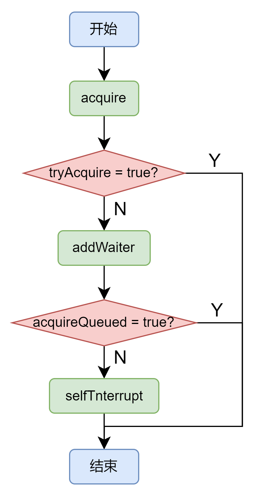

> AbstractQueuedSynchronizer抽象类是核心，需要重点掌握。它提供了一个基于FIFO队列，可以用于构建锁或者其他相关同步装置的基础框架。

# 面试问题

- 什么是AQS ?

# AQS 队列

## AQS 节点

```java
public class Node {
    // 	当前节点在队列中的状态
    volatile int waitStatus;
    volatile Node prev;
    volatile Node next;
    // 表示处于该节点的线程
    volatile Thread thread;
    // 指向下一个处于CONDITION状态的节点（由于本篇文章不讲述Condition Queue队列，这个指针不多介绍）
    Node nextWaiter;
}
```

### 线程两种锁的模式

| 模式        | 含义              |
|-----------|-----------------|
| SHARED    | 表示线程以共享的模式等待锁   |
| EXCLUSIVE | 表示线程正在以独占的方式等待锁 |

### waitStatus 枚举值

| waitStatus | 解释                                  |
|------------|-------------------------------------|
| 0          | 值                                   |
| CANCELLED  | 为1，表示线程获取当一个Node被初始化的时候的默认锁的请求已经取消了 |
| SIGNAL     | 为-1，表示线程已经准备好了，就等资源释放了              |
| CONDITION  | 为-2，表示节点在等待队列中，节点线程等待唤醒             |
| PROPAGATE  | 为-3，当前线程处在SHARED情况下，该字段才会使用         |


# 核心介绍

## acquire函数
该函数以独占模式获取(资源)，忽略中断，即线程在 acquire 过程中，中断此线程是无效的。源码如下
```java
public final void acquire(int arg) {
    if (!tryAcquire(arg) &&
        acquireQueued(addWaiter(Node.EXCLUSIVE), arg))
        selfInterrupt();
}
```
由上述源码可以知道，当一个线程调用acquire时，调用方法流程如下。

