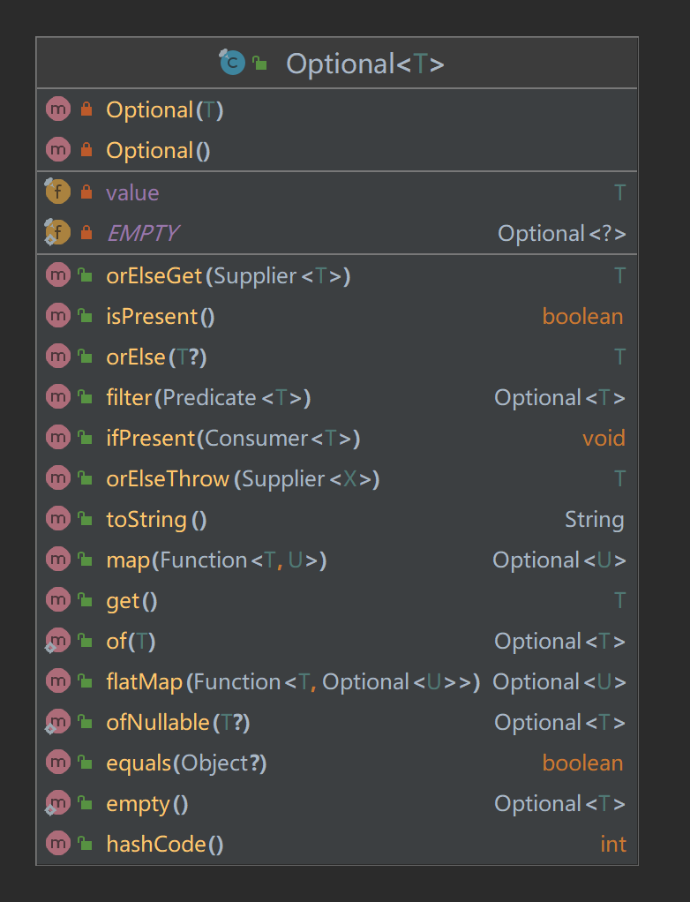

# Optional 工具学习
> 这是一个可以为null的容器对象。如果值存在则isPresent()方法会返回true，调用get()方法会返回该对象。

## Optional UML


## 构建方法

### 构造函数

```java
private Optional() {
    this.value = null;
}
        
private Optional(T value) {
    this.value = Objects.requireNonNull(value);
}
```

### empty
> 返回一个空的Optional实例。

```java
private static final Optional<?> EMPTY = new Optional<>();

public static <T> Optional<T> empty() {
    @SuppressWarnings("unchecked")
    Optional<T> t = (Optional<T>) EMPTY;
    return t;
}
```

### of
> 为非null的值创建一个Optional。
> 如果传入的对象为 null，则抛出 NullPointerException 异常。

```java
public static <T> Optional<T> of(T value) {
    return new Optional<>(value);
}
```

### ofNullable
> 为指定的值创建一个Optional，如果指定的值为null，则返回一个空的Optional。

```java
public static <T> Optional<T> ofNullable(T value) {
    return value == null ? empty() : of(value);
}
```

## 操作方法
### get
> 如果Optional有值则将其返回，否则抛出 NoSuchElementException。

```java
public T get() {
    if (value == null) {
        throw new NoSuchElementException("No value present");
    }
    return value;
}
```

### orElse
> 如果有值则将其返回，否则返回指定的其它值。

```java
public T orElse(T other) {
    return value != null ? value : other;
}
```

### orElseGet
> orElseGet与orElse方法类似，区别在于得到的默认值。orElse 方法将传入的字符串作为默认值，
> orElseGet 方法可以接受Supplier接口的实现用来生成默认值。

```java
public T orElseGet(Supplier<? extends T> other) {
    return value != null ? value : other.get();
}
```

### orElseThrow
> 如果有值则将其返回，否则抛出supplier接口创建的异常。

```java
public <X extends Throwable> T orElseThrow(Supplier<? extends X> exceptionSupplier) throws X {
    if (value != null) {
        return value;
    } else {
        throw exceptionSupplier.get();
    }
}
```

### isPresent
> 如果值存在返回true，否则返回false。

```java
public boolean isPresent() {
    return value != null;
}
```

### ifPresent
> 如果Optional实例有值则为其调用 consumer，否则不做处理

```java
public void ifPresent(Consumer<? super T> consumer) {
    if (value != null)
        consumer.accept(value);
}
```

### filter
> 如果有值并且满足断言条件返回包含该值的 Optional，否则返回空 Optional。

```java
public Optional<T> filter(Predicate<? super T> predicate) {
    Objects.requireNonNull(predicate);
    if (!isPresent())
        return this;
    else
        return predicate.test(value) ? this : empty();
}
```
### map
> 如果有值，则对其执行调用mapping函数得到返回值。如果返回值不为 null，
> 则创建包含 mapper 返回值的Optional作为map方法返回值，否则返回空 Optional。

```java
public <U> Optional<U> map(Function<? super T, ? extends U> mapper) {
    Objects.requireNonNull(mapper);
    if (!isPresent())
        return empty();
    else {
        return Optional.ofNullable(mapper.apply(value));
    }
}
```

### flatMap
> 如果有值，为其执行 mapper 函数返回 Optional 类型返回值，否则返回空 Optional。
> flatMap 与 map(Function) 方法类似，区别在于flatMap中的mapper返回值必须是 Optional。
> 调用结束时，flatMap 不会对结果用 Optional 封装。


```java
public<U> Optional<U> flatMap(Function<? super T, Optional<U>> mapper) {
    Objects.requireNonNull(mapper);
    if (!isPresent())
        return empty();
    else {
        return Objects.requireNonNull(mapper.apply(value));
    }
}
```