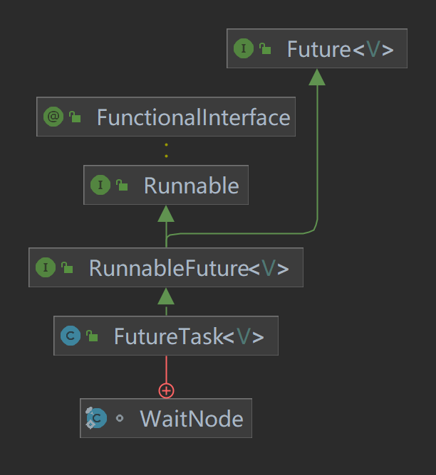

# Future Task

可取消的异步计算。此类提供Future的基本实现，包括启动和取消计算、查询计算是否完成以及检索计算结果的方法。只有在计算完成后才能检索结果；如果计算尚未完成， get方法将阻塞。一旦计算完成，就不能重新开始或取消计算（除非使用runAndReset调用计算）。
FutureTask可用于包装Callable或Runnable对象。因为FutureTask实现了Runnable ，所以可以将FutureTask提交给Executor执行。
除了作为独立类之外，此类还提供protected的功能，在创建自定义任务类时可能很有用

## Question
> - FutureTask用来解决什么问题的? 为什么会出现? 
> - FutureTask类结构关系怎么样的? 
> - FutureTask的线程安全是由什么保证的? 
> - FutureTask结果返回机制? 
> - FutureTask内部运行状态的转变? 
> - FutureTask通常会怎么用? 举例说明。

## Future Task 类图



## 源码

### Future 接口

```java
public interface Future<V> {
    boolean cancel(boolean mayInterruptIfRunning);
    boolean isCancelled();
    boolean isDone();
    V get() throws InterruptedException, ExecutionException;
    V get(long timeout, TimeUnit unit)
        throws InterruptedException, ExecutionException, TimeoutException;
}
```

####  `boolean cancel(boolean mayInterruptIfRunning)`
> 尝试取消此任务的执行。如果任务已完成、已被取消或由于某些其他原因无法取消，则此尝试将失败。
> 如果成功，并且在调用cancel时此任务尚未启动，则此任务不应该运行。
> 如果任务已经开始，则mayInterruptIfRunning参数确定是否应该中断执行该任务的线程以尝试停止该任务。
> 此方法返回后，对isDone的后续调用将始终返回true。如果此方法返回true，则对isCancelled的后续调用将始终返回true 。

#### `boolean isCancelled()`
> 如果此任务在正常完成之前被取消，则返回true 。

#### `boolean isDone()`
> 如果此任务完成，则返回true 。完成可能是由于正常终止、异常或取消——在所有这些情况下，此方法都将返回true 。

#### `V get()`
> 等待执行完成，然后返回结果。如果在等待的时，任务被取消，则会抛出 CancellationException

#### `V get(long timeout, TimeUnit unit)`
> 在 get() 的基础上增加了等待时间


### FutureTask 源码

#### 核心字段
```java
// 此任务的运行状态，最初为 NEW。
// 运行状态仅在 set、setException 和 cancel 方法中转换为终端状态。
private volatile int state;
private static final int NEW          = 0;
private static final int COMPLETING   = 1;
private static final int NORMAL       = 2;
private static final int EXCEPTIONAL  = 3;
private static final int CANCELLED    = 4;
private static final int INTERRUPTING = 5;
private static final int INTERRUPTED  = 6;

private Callable<V> callable;

// 从 get() 返回的结果或抛出的异常
private Object outcome; 

// 运行的线程
private volatile Thread runner;
// 等待线程堆栈
private volatile WaitNode waiters;
```

#### state 转换

```
NEW
 ├─> COMPLETING 
 │       ├─> NORMAL
 │       └─> EXCEPTIONAL
 ├─> CANCELLED
 └─> INTERRUPTING ─ INTERRUPTED
```
- NEW: 

  表示是个新的任务或者还没被执行完的任务。这是初始状态。

- COMPLETING: 

  任务已经执行完成或者执行任务的时候发生异常，但是任务执行结果或者异常原因还没有保存到outcome字段(outcome字段用来保存任务执行结果，如果发生异常，则用来保存异常原因)的时候，状态会从NEW变更到COMPLETING。但是这个状态会时间会比较短，属于中间状态。

- NORMAL:

  任务已经执行完成并且任务执行结果已经保存到outcome字段，状态会从COMPLETING转换到NORMAL。这是一个最终态。

- EXCEPTIONAL:

  任务执行发生异常并且异常原因已经保存到outcome字段中后，状态会从COMPLETING转换到EXCEPTIONAL。这是一个最终态。

- CANCELLED:

  任务还没开始执行或者已经开始执行但是还没有执行完成的时候，用户调用了cancel(false)方法取消任务且不中断任务执行线程，这个时候状态会从NEW转化为CANCELLED状态。这是一个最终态。

- INTERRUPTING:

  任务还没开始执行或者已经执行但是还没有执行完成的时候，用户调用了cancel(true)方法取消任务并且要中断任务执行线程但是还没有中断任务执行线程之前，状态会从NEW转化为INTERRUPTING。这是一个中间状态。

- INTERRUPTED:

  调用interrupt()中断任务执行线程之后状态会从INTERRUPTING转换到INTERRUPTED。这是一个最终态。 有一点需要注意的是，所有值大于COMPLETING的状态都表示任务已经执行完成(任务正常执行完成，任务执行异常或者任务被取消)。


#### 核心方法 run()

```java
public void run() {
    if (state != NEW || // 任务已经开始执行或者结束
        !UNSAFE.compareAndSwapObject(this, runnerOffset,
                                     null, Thread.currentThread())) // CAS 抢夺任务，防止多个线程同时准备执行这一个任务
        return;
    try {
        Callable<V> c = callable;
        // c != null 健壮性判断
        // state == NEW 再次确认任务还未执行
        if (c != null && state == NEW) { 
            V result;
            boolean ran;
            try {
                result = c.call(); // 执行任务
                ran = true;
            } catch (Throwable ex) {
                result = null;
                ran = false;
                setException(ex);  // 执行失败，保存抛出异常
            }
            // 可以防止保存结果的异常被 catch 捕获
            if (ran)
                set(result); // 执行成功，保存执行结果
        }
    } finally {
        // runner must be non-null until state is settled to
        // prevent concurrent calls to run()
        runner = null; //
        // state must be re-read after nulling runner to prevent
        // leaked interrupts
        int s = state;
        if (s >= INTERRUPTING) // 确保 state 转换 INTERRUPTING -> INTERRUPTED
            handlePossibleCancellationInterrupt(s);
    }
}
```

#### 保存异常方法 setException(Throwable t)

```java
protected void setException(Throwable t) {
    // 改变状态 NEW -> COMPLETING
    if (UNSAFE.compareAndSwapInt(this, stateOffset, NEW, COMPLETING)) {
        outcome = t; // 保存异常结果
        // 把 COMPLETING 更改为终态 EXCEPTIONAL
        UNSAFE.putOrderedInt(this, stateOffset, EXCEPTIONAL); // final state
        finishCompletion(); // 通知阻塞线程
    }
}
```

- 为什么要 NEW->COMPLETING 要使用 CAS ?

  防止取消任务（ NEW->CANCELLED），存在并发安全。 

#### 保存结果 set(V v)

```java
protected void set(V v) {
    // 更改状态为中间态 COMPLETING
    if (UNSAFE.compareAndSwapInt(this, stateOffset, NEW, COMPLETING)) {
        outcome = v; // 保存正常结果
        // 把中间状态更改为最终状态 NORMAL
        UNSAFE.putOrderedInt(this, stateOffset, NORMAL); // final state
        finishCompletion();
    }
}
```

#### 结束通知 finishCompletion()

```java
private void finishCompletion() {
    // assert state > COMPLETING;
    for (WaitNode q; (q = waiters) != null;) {
        if (UNSAFE.compareAndSwapObject(this, waitersOffset, q, null)) {
            for (;;) {
                Thread t = q.thread;
                if (t != null) {
                    q.thread = null;
                    LockSupport.unpark(t);
                }
                WaitNode next = q.next;
                if (next == null)
                    break;
                q.next = null; // unlink to help gc
                q = next;
            }
            break;
        }
    }

    done(); // 扩展接口(空方法)

    callable = null;        // to reduce footprint
}
```

#### 核心方法 get() 

```java
 public V get() throws InterruptedException, ExecutionException {
    int s = state;
    if (s <= COMPLETING) // NEW 或者 COMPLETING 
        s = awaitDone(false, 0L); // 进入等待
    return report(s); // 结果处理
}
```

#### 核心方法 get(long timeout, TimeUnit unit)

```java
public V get(long timeout, TimeUnit unit)
    throws InterruptedException, ExecutionException, TimeoutException {
    // 健壮性判断
    if (unit == null)
        throw new NullPointerException();
    int s = state;
    // 如果任务还未执行完成且等待后任务完成，处理返回结果，否则抛出 TimeoutException 超时异常
    if (s <= COMPLETING &&
        (s = awaitDone(true, unit.toNanos(timeout))) <= COMPLETING)
        throw new TimeoutException();
    return report(s); // 结果处理
}
```

#### 核心方法 awaitDone(boolean timed, long nanos)

```java
private int awaitDone(boolean timed, long nanos)
    throws InterruptedException {
    final long deadline = timed ? System.nanoTime() + nanos : 0L;
    WaitNode q = null;
    boolean queued = false;
    for (;;) {
        // 该线程被中断了，移除等待节点并抛出中断异常
        if (Thread.interrupted()) {
            removeWaiter(q);
            throw new InterruptedException();
        }

        int s = state;
        // 已经执行完成，返回 state
        if (s > COMPLETING) {
            if (q != null)
                q.thread = null;
            return s;
        }
        // 正在写入结果或异常，只需要放弃CPU等待状态改变
        else if (s == COMPLETING) // cannot time out yet
            Thread.yield();
        // 创建节点
        else if (q == null)
            q = new WaitNode();
        // 如果节点没有加入队列里，尝试把节点加入队列
        else if (!queued)
            queued = UNSAFE.compareAndSwapObject(this, waitersOffset,
                                                 q.next = waiters, q);
        // 如果设置了超时，判断是否超时，如果超时直接返回状态，否则 park 剩下时间
        else if (timed) {
            nanos = deadline - System.nanoTime();
            // 已经超时，删除节点返回状态
            if (nanos <= 0L) {
                removeWaiter(q);
                return state;
            }
            LockSupport.parkNanos(this, nanos);
        }
        // 没有设置超时，等待被唤醒或中断
        else
            LockSupport.park(this);
    }
}
```

#### 结果处理 report(int s)

```java
private V report(int s) throws ExecutionException {
    Object x = outcome;
    if (s == NORMAL) // 任务正常执行返回
        return (V)x;
    if (s >= CANCELLED) // 任务被取消
        throw new CancellationException();
    // 任务被中断或其他执行异常
    throw new ExecutionException((Throwable)x);
}
```

#### 核心方法 cancel(boolean mayInterruptIfRunning)

```java
public boolean cancel(boolean mayInterruptIfRunning) {
    // 任务还没有执行，尝试修改 state 为 INTERRUPTING 或 CANCELLED
    if (!(state == NEW &&
          UNSAFE.compareAndSwapInt(this, stateOffset, NEW,
              mayInterruptIfRunning ? INTERRUPTING : CANCELLED)))
        return false;
    // 任务已经开始执行，给线程添加中断标志并更改为最终状态
    try {    // in case call to interrupt throws exception
        if (mayInterruptIfRunning) {
            try {
                Thread t = runner;
                if (t != null)
                    t.interrupt();
            } finally { // final state
                UNSAFE.putOrderedInt(this, stateOffset, INTERRUPTED);
            }
        }
    } finally {
        // 通知等待的线程
        finishCompletion();
    }
    return true;
}
```

#### 核心方法 runAndReset()

```java
protected boolean runAndReset() {
    // 与 run() 原理相同，主要方法不同是在处理结果的时候。
    // runAndReset() 在调用成功后不会保存执行结果，只会记录异常或取消任务。
    if (state != NEW ||
        !UNSAFE.compareAndSwapObject(this, runnerOffset,
                                     null, Thread.currentThread()))
        return false;
    boolean ran = false;
    int s = state;
    try {
        Callable<V> c = callable;
        if (c != null && s == NEW) {
            try {
                c.call(); // don't set result
                ran = true;
            } catch (Throwable ex) {
                setException(ex);
            }
        }
    } finally {
        // runner must be non-null until state is settled to
        // prevent concurrent calls to run()
        runner = null;
        // state must be re-read after nulling runner to prevent
        // leaked interrupts
        s = state;
        if (s >= INTERRUPTING)
            handlePossibleCancellationInterrupt(s);
    }
    return ran && s == NEW;
}
```

- 在什么时候使用？

  在定时任务线程池时，周期性任务使用。
